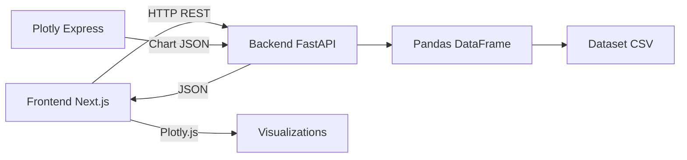

# CyberAttack Analytics Dashboard

> **Plateforme d'analyse et de visualisation des cyberattaques dans le secteur financier (2015-2025)**

Application web full-stack permettant d'analyser, visualiser et comprendre l'évolution des menaces cyber ciblant les services financiers à travers 9 visualisations interactives et 4 KPIs stratégiques.

## Démonstration Vidéo

**[Voir la démonstration complète de la plateforme](https://www.tella.tv/video/finance-cyberattack-analytics-1-235i)**

[](https://nextjs.org/)
[](https://fastapi.tiangolo.com/)
[](https://www.python.org/)
[](https://www.typescriptlang.org/)

---

## Table des Matières

- [À Propos](#à-propos)
- [Fonctionnalités](#fonctionnalités)
- [Stack Technique](#stack-technique)
- [Architecture](#architecture)
- [Installation](#installation)
- [Démarrage](#démarrage)
- [Structure du Projet](#structure-du-projet)
- [API Endpoints](#api-endpoints)
- [Pages de l'Application](#pages-de-lapplication)
- [Dataset](#dataset)
- [Développement](#développement)
- [Équipe](#équipe)
- [Licence](#licence)

---

## À Propos

**CyberAttack Analytics Dashboard** est un projet académique de data visualization focalisé sur l'analyse des cyberattaques dans le secteur bancaire et financier entre 2015 et 2025. Il s'appuie sur un dataset de **486 incidents réels** pour offrir une vision complète des menaces cyber contemporaines.

### Objectifs

- **Visualiser** la distribution temporelle et géographique des attaques
- **Analyser** les types d'attaques, sources et vulnérabilités exploitées
- **Quantifier** l'impact financier et humain des cybermenaces
- **Évaluer** l'efficacité des mécanismes de défense déployés

---

## Fonctionnalités

### Dashboard Principal

- **4 KPIs Globaux** : Menaces détectées, impact financier, utilisateurs compromis, temps de reponse
- **2 Tableaux Analytiques** : Top 5 incidents critiques, Top 10 pays ciblés
- **Carte Mondiale Interactive** : Répartition géographique avec bulles proportionnelles aux pertes

### Analyse Univariée (4 graphiques)

- Évolution temporelle des cyberattaques (2015-2025)
- Répartition des types d'attaques (Donut chart)
- Origines des menaces (Bar chart)
- Distribution géographique des incidents (Horizontal bar)

### Analyse Bivariée (3 graphiques)

- Évolution des pertes financières par type de menace
- Répartition des types d'attaques par pays (Top 5)
- Efficacité des mécanismes de défense (avec code couleur)

### Design & UX

- Interface cybersécurité moderne avec dark mode
- Animations fluides (count-up, fade-in, scanning effects)
- Responsive design (Desktop, Tablet, Mobile)
- Icônes Lucide React professionnelles
- Graphiques interactifs sans barre d'outils encombrante

---

## Stack Technique

### Frontend

| Technologie       | Version | Rôle                            |
| ----------------- | ------- | ------------------------------- |
| **Next.js**       | 15      | Framework React avec App Router |
| **TypeScript**    | 5.0+    | Typage statique                 |
| **Tailwind CSS**  | 3.4+    | Styling utilitaire              |
| **Plotly.js**     | 2.30+   | Graphiques interactifs          |
| **Framer Motion** | 11.0+   | Animations                      |
| **Lucide React**  | 0.4+    | Bibliothèque d'icônes           |

### Backend

| Technologie        | Version | Rôle                     |
| ------------------ | ------- | ------------------------ |
| **FastAPI**        | 0.109   | API REST asynchrone      |
| **Pandas**         | 2.2.0   | Traitement de données    |
| **NumPy**          | 1.26.3  | Calculs numériques       |
| **Plotly Express** | 5.18.0  | Génération de graphiques |
| **Uvicorn**        | 0.27.0  | Serveur ASGI             |

---

## Architecture



**Architecture 3-tiers** :

- **Présentation** : Next.js 15 avec Server/Client Components
- **Logique Métier** : FastAPI avec services modulaires
- **Données** : Dataset CSV chargé en mémoire (Pandas)

---

## Installation

### Prérequis

- **Python** ≥ 3.9
- **Node.js** ≥ 18
- **npm** ≥ 9

### 1. Cloner le Projet

```bash
git clone <repository-url>
cd "Mini Projet Securité Informatique"
```

### 2. Setup Backend (Python)

```bash
# Veuillez Naviguer vers le backend
cd backend

# Créer l'environnement virtuel
python -m venv venv

# Penser à Activer l'environnement virtuel
# Windows :
venv\Scripts\activate
# macOS/Linux :
source venv/bin/activate

# Installer les dépendances
pip install -r requirements.txt
```

### 3. Setup Frontend (Node.js)

```bash
# Naviguer vers le frontend (depuis la racine)
cd frontend

# Installer les dépendances
npm install
```

---

## Démarrage

### Lancer le Backend (Terminal 1)

```bash
cd backend
venv\Scripts\activate  # Windows
# source venv/bin/activate  # macOS/Linux

uvicorn main:app --reload --host 0.0.0.0 --port 8000
```

**Backend disponible** : [`http://localhost:8000`](http://localhost:8000)
**Documentation API** : [`http://localhost:8000/docs`](http://localhost:8000/docs)

### Lancer le Frontend (Terminal 2)

```bash
cd frontend
npm run dev
```

**Application disponible** : [`http://localhost:3000`](http://localhost:3000)

---

## Structure du Projet

```
Mini Projet Securité Informatique/
│
├── backend/                        # API FastAPI
│   ├── data/
│   │   └── dataset_final.csv       # Dataset de 486 incidents
│   ├── routers/
│   │   ├── analysis.py             # Endpoints KPIs et stats
│   │   ├── visualizations.py       # Endpoints graphiques
│   │   └── dataset.py              # Endpoints dataset info
│   ├── services/
│   │   ├── preprocess.py           # Chargement du dataset
│   │   ├── analysis_engine.py      # Calculs KPIs
│   │   └── visualization_engine.py # Génération graphiques Plotly
│   ├── main.py                     # Point d'entrée FastAPI
│   ├── requirements.txt            # Dépendances Python
│   └── venv/                       # Environnement virtuel
│
├── frontend/                       # Application Next.js
│   ├── app/
│   │   ├── page.tsx                # Dashboard Principal
│   │   ├── univariate/
│   │   │   └── page.tsx            # Analyse Univariée
│   │   ├── bivariate/
│   │   │   └── page.tsx            # Analyse Bivariée
│   │   ├── components/
│   │   │   ├── Navbar.tsx          # Navigation
│   │   │   ├── KPICard.tsx         # Carte KPI animée
│   │   │   ├── DataTable.tsx       # Tableau stylisé
│   │   │   └── Chart.tsx           # Wrapper Plotly.js
│   │   └── lib/
│   │       ├── api.ts              # Client API
│   │       └── utils.ts            # Utilitaires formatage
│   ├── styles/
│   │   └── globals.css             # Styles Tailwind
│   ├── package.json                # Dépendances Node.js
│   └── tailwind.config.ts          # Config Tailwind
│
├── PRD_CyberAttack_Analytics_Dashboard_v2.md
└── README.md
```

---

## API Endpoints

### Dashboard

| Méthode | Endpoint                       | Description                 |
| ------- | ------------------------------ | --------------------------- |
| `GET`   | `/api/dashboard/kpis`          | 4 KPIs globaux              |
| `GET`   | `/api/dashboard/top-incidents` | Top 5 incidents coûteux     |
| `GET`   | `/api/dashboard/top-countries` | Top 10 pays ciblés          |
| `GET`   | `/api/dashboard/map`           | Carte géographique mondiale |

### Analyse Univariée

| Méthode | Endpoint                                    | Description           |
| ------- | ------------------------------------------- | --------------------- |
| `GET`   | `/api/univariate/temporal-evolution`        | Évolution temporelle  |
| `GET`   | `/api/univariate/attack-types-distribution` | Types d'attaques      |
| `GET`   | `/api/univariate/attack-sources`            | Sources des attaques  |
| `GET`   | `/api/univariate/countries-distribution`    | Distribution par pays |

### Analyse Bivariée

| Méthode | Endpoint                                 | Description                |
| ------- | ---------------------------------------- | -------------------------- |
| `GET`   | `/api/bivariate/losses-by-type-temporal` | Pertes par type (temporel) |
| `GET`   | `/api/bivariate/types-by-country`        | Types par pays             |
| `GET`   | `/api/bivariate/defense-efficiency`      | Efficacité des défenses    |

---

## Pages de l'Application

### 1. Dashboard Principal (`/`)

Vue d'ensemble stratégique avec :

- 4 KPIs animés (menaces, pertes, utilisateurs, temps de réponse)
- Carte mondiale interactive (Scatter Geo Map)
- 2 tableaux analytiques (incidents critiques + pays ciblés)

### 2. Analyse Univariée (`/univariate`)

Distribution statistique avec **4 graphiques en grille 2x2** :

- Évolution temporelle (Line chart)
- Types d'attaques (Donut chart)
- Sources des menaces (Bar chart)
- Distribution géographique (Horizontal bar)

### 3. Analyse Bivariée (`/bivariate`)

Relations multivariées avec **3 graphiques** :

- Évolution pertes financières par type (Multiple lines) - Pleine largeur
- Répartition types par pays (Grouped bar) - Colonne gauche
- Efficacité mécanismes défense (Color-coded bar) - Colonne droite

---

## Dataset

**Source** : `backend/data/dataset_final.csv`

| Caractéristique        | Valeur                                              |
| ---------------------- | --------------------------------------------------- |
| **Nombre d'incidents** | 486                                                 |
| **Période couverte**   | 2015 - 2025                                         |
| **Pays**               | ~15 pays                                            |
| **Types d'attaques**   | Phishing, Ransomware, DDoS, Man-in-the-Middle, etc. |

### Colonnes Principales

- `Country` : Pays ciblé
- `Year` : Année de l'incident
- `Attack Type` : Type de cyberattaque
- `Financial Loss (in Million $)` : Pertes financières (M$)
- `Number of Affected Users` : Utilisateurs impactés
- `Attack Source` : Origine de l'attaque
- `Security Vulnerability Type` : Vulnérabilité exploitée
- `Defense Mechanism Used` : Mécanisme de défense
- `Incident Resolution Time (in Hours)` : Temps de résolution

---

## Développement

### Ajouter un Endpoint API

1. **Backend** : Créer la route dans `backend/routers/`
2. **Service** : Implémenter la logique dans `backend/services/`
3. **Frontend** : Ajouter la fonction dans `frontend/app/lib/api.ts`
4. **Composant** : Utiliser le endpoint dans le composant React

### Ajouter une Page

1. Créer `frontend/app/[nom-page]/page.tsx`
2. Ajouter le lien dans `Navbar.tsx`
3. Définir les endpoints API nécessaires

### Scripts Utiles

**Frontend** :

```bash
npm run dev          # Mode développement
npm run build        # Build production
npm run lint         # Linter ESLint
```

**Backend** :

```bash
uvicorn main:app --reload  # Hot-reload
pytest                      # Tests unitaires (si configurés)
```

---

## Design System

### Palette de Couleurs

- **Background** : `#13121d` (Navy dark)
- **Cards** : `#242332`
- **Accent Cyan** : `#06b6d4`
- **Accent Red** : `#ef4444`
- **Accent Orange** : `#f97316`
- **Accent Green** : `#22c55e`

### Typographie

- **Titres** : Monospace, Bold, Uppercase
- **Body** : System font stack, Regular
- **KPIs** : Monospace, Black, 4xl

---

## Notes Importantes

**Points d'attention** :

- Toujours **activer l'environnement virtuel** avant de lancer le backend
- Le dataset doit être présent dans `backend/data/dataset_final.csv`
- CORS configuré pour `http://localhost:3000` uniquement
- Graphiques Plotly en mode dark (`template='plotly_dark'`)

---

## Licence

Ce projet est un **mini-projet académique** réalisé dans le cadre d'une présentation sur la cybersécurité dans le secteur financier.

---

## Équipe

Ce projet a été développé par trois étudiants en **Big Data & Intelligence Artificielle** :

| Membre                   | Rôle                      | Description                                                                | Photo                                        |
| ------------------------ | ------------------------- | -------------------------------------------------------------------------- | -------------------------------------------- |
| **Bachirou Konaté**      | Collecte des Données      | Le chasseur d'informations, le carburant de la machine                     |  |
| **Michel Sagesse Kolié** | Analyse & Traitement      | La vision d'ensemble, le cerveau analytique                                |   |
| **Karamo Sylla**         | Visualisation & Interface | L'architecte visuel qui transforme les données brutes en récits captivants |   |

**Équipe CyberAttack Analytics**
_Octobre 2025_

---
